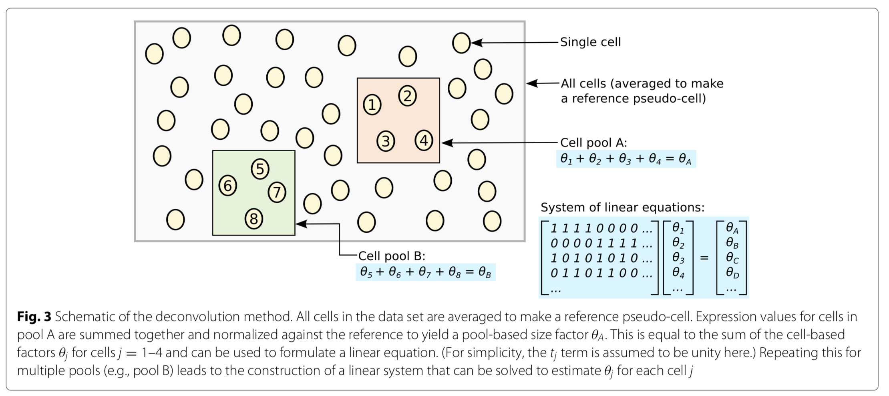

# Paper

* **Title**: Pooling across cells to normalize single-cell RNA sequencing data with many zero counts
* **Authors**: Lun et al.
* **Tags**: Normalization, Pooling
* **Year**: 2016
* **Rating**: 6/10

# Summary

* What
  * Authors propose a polling based normalization method for scRNA data to deal with zero inflation problem. 

http://singlecellexplorer.org
https://github.com/d-feng/scExplorer
-------------------------

# Intro Notes

* From each cell, mRNA is isolated and reverse-transcribed into cDNA, which is amplified and subjected to massively parallel sequenc- ing [1]. The sequencing reads are mapped to a reference genome, such that the number of reads mapped to each gene can be used to quantify its expression. Alternatively, transcript molecules can be counted directly using unique molecular identifiers (UMIs). 

* Two broad classes of methods for scaling normalization are available: those using spike-in RNA sets and those using the counts from the profiled cellular RNA. In the former, the same quantity of spike-in RNA is added to each cell prior to library preparation. Normalization is then performed by scaling the counts to equalize spike-in coverage between cells. For the methods using cellular counts, the assumption is that most genes are not DE across the sampled cells. Counts are scaled so that there is, on average, no fold-difference in expression between cells for the majority of genes. This is the underlying concept of commonly used methods such as DESeq and trimmed mean of M values (TMM) normalization.

# Methods
The deconvolution method consists of several key steps:
1. Defining a pool of cells
2. Summing expression values across all cells in the pool • Normalizing the cell pool against an average reference, using the summed expression values
3. Repeating this for many different pools of cells to construct a linear system
4. Deconvolving the pool-based size factors to their cell-based counterparts

