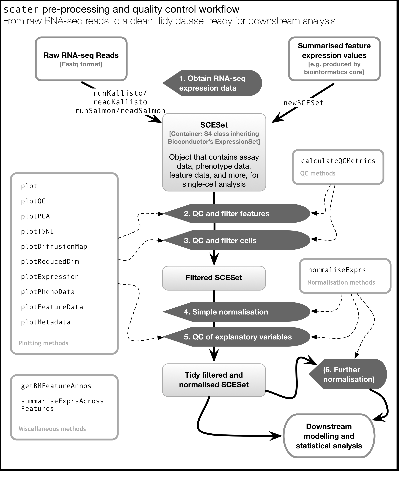

# SingleCellAnalysis

https://scrnaseq-course.cog.sanger.ac.uk/website/index.html

## Biological Terms that One should know
Transcriptomics: The study of transcriptomes and their functions.

Transcriptome: The transcriptome is the set of all RNA molecules in one cell or a population of cells. 

Bulk RNA-seq : Measures the average expression level for each gene across a large population of input cells  
	* Useful for comparative transcriptomics, e.g. samples of the same tissue from different species  
	* Insufficient for studying heterogeneous systems, e.g. early development studies, complex tissues (brain)  
	* Does not provide insights into the stochastic nature of gene expression  

Single-cell RT-qPCR :

scRNA-seq : A new technology, first publication by (Tang et al. 2009)  
* Measures the distribution of expression levels for each gene across a population of cells.  
* Allows to study new biological questions in which cell-specific changes in transcriptome are important, e.g. cell type identification, heterogeneity of cell responses, stochasticity of gene expression, inference of gene regulatory networks across the cells.  
* Datasets range from 102 to 106 cells and increase in size every year
* Several computational analysis methods from bulk RNA-seq can be used
* In most cases computational analysis requires adaptation of the existing methods or development of new ones

## Workflow
Overall, experimental scRNA-seq protocols are similar to the methods used for bulk RNA-seq.

## Computational Analysis
 The first steps (yellow) are general for any highthroughput sequencing data. Later steps (orange) require a mix of existing RNASeq analysis methods and novel methods to address the technical difference of scRNASeq. Finally the biological interpretation (blue) should be analyzed with methods specifically developed for scRNASeq.

## Processing Raw scRNA-seq Data
1. Once you’ve obtained your single-cell RNA-seq data, the first thing you need to do with it is check the quality of the reads you have sequenced.

## R/Bioconductor

Github is also a version control system which stores multiple versions of any package. By default the most recent “master” version of the package is installed. If you want an older version or the development branch this can be specified using the “ref” parameter:

devtools::install_github("tallulandrews/M3D", ref="nbumi")  
devtools::install_github("tallulandrews/M3Drop", ref="434d2da28254acc8de4940c1dc3907ac72973

* Source Package Installation  
install.packages("M3Drop_3.05.00.tar.gz", type="source")

* Another special type of character data are colours.   

reds = c("red", rgb(1,0,0), hsv(0, 1, 1))  
barplot(c(1,1,1), col=reds, names=c("by_name", "by_rgb", "by_hsv"))

* To make R read text as character data instead of factors set the environment option stringsAsFactors=FALSE. This must be done at the start of each R session.

options(stringsAsFactors=FALSE)  

* Tidy data is a concept largely defined by Hadley Wickham (Wickham 2014). Tidy data has the following three characteristics:  
	* Each variable has its own column.  
	* Each observation has its own row.  
	* Each value has its own cell.  

* SingleCellExperiment (SCE) is a S4 class for storing data from single-cell experiments. This includes specialized methods to store and retrieve spike-in information, dimensionality reduction coordinates and size factors for each cell, along with the usual metadata for genes and libraries.  

* In the SingleCellExperiment, users can assign arbitrary names to entries of assays. To assist interoperability between packages, some suggestions for what the names should be for particular types of data are provided by the authors:  

counts: Raw count data, e.g., number of reads or transcripts for a particular gene.  
normcounts: Normalized values on the same scale as the original counts. For example, counts divided by cell-specific size factors that are centred at unity.  
logcounts: Log-transformed counts or count-like values. In most cases, this will be defined as log-transformed normcounts, e.g., using log base 2 and a pseudo-count of 1.  
cpm: Counts-per-million. This is the read count for each gene in each cell, divided by the library size of each cell in millions.  
tpm: Transcripts-per-million. This is the number of transcripts for each gene in each cell, divided by the total number of transcripts in that cell (in millions).  

* scater is a R package for single-cell RNA-seq analysis (McCarthy et al. 2017). The package contains several useful methods for quality control, visualisation and pre-processing of data prior to further downstream analysis.  

scater features the following functionality:  
	* Automated computation of QC metrics  
	* Transcript quantification from read data with pseudo-alignment  
	* Data format standardisation  
	* Rich visualizations for exploratory analysis  
	* Seamless integration into the Bioconductor universe  
	* Simple normalisation methods  

 Keep in mind that this figure represents the original version of scater where an SCESet class was used. In the newest version this figure is still correct, except that SCESet can be substituted with the SingleCellExperiment class.

  

* ggplot2  
	* Your data must be a dataframe if you want to plot it using ggplot2.  
	* Use the aes mapping function to specify how variables in the dataframe map to features on your plot  
	* Use geoms to specify how your data should be represented on your graph eg. as a scatterplot, a barplot, a boxplot etc.  

## Cleaning the expression Matrix  
Once gene expression has been quantified it is summarized as an expression matrix where each row corresponds to a gene (or transcript) and each column corresponds to a single cell. This matrix should be examined to remove poor quality cells which were not detected in either read QC or mapping QC steps. Failure to remove low quality cells at this stage may add technical noise which has the potential to obscure the biological signals of interest in the downstream analysis.

Since there is currently no standard method for performing scRNASeq, to perform QC we will be looking for cells which are outliers with respect to the rest of the dataset rather than comparing to independent quality standards.  

## Seurat
We recommend using Seurat for datasets with more than  5000 cells. For smaller dataset a good alternative will be SC3.  

###  QC and selecting cells for further analysis

