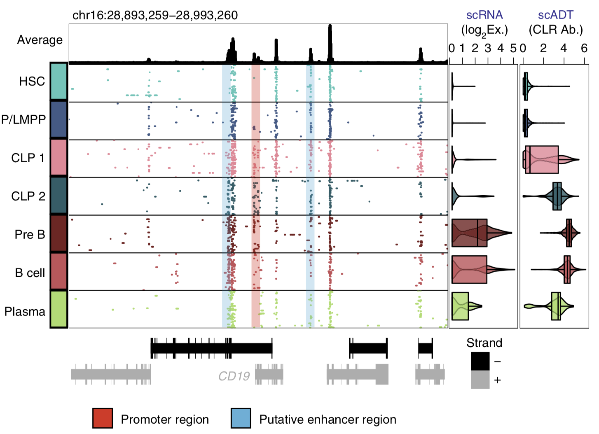
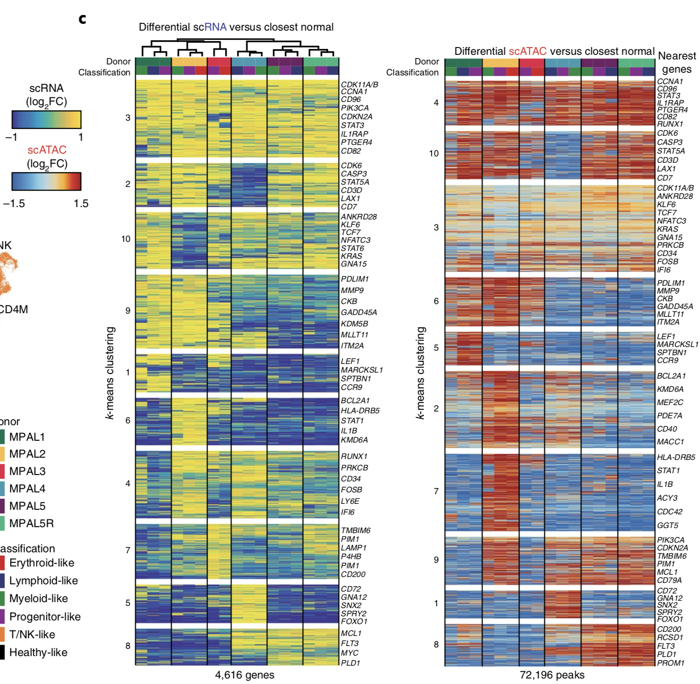
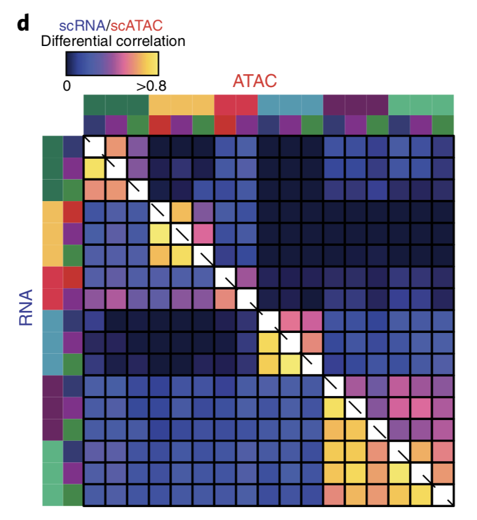
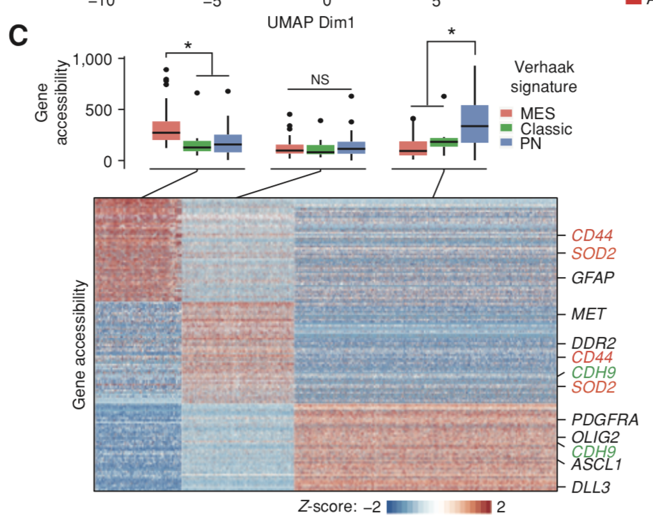
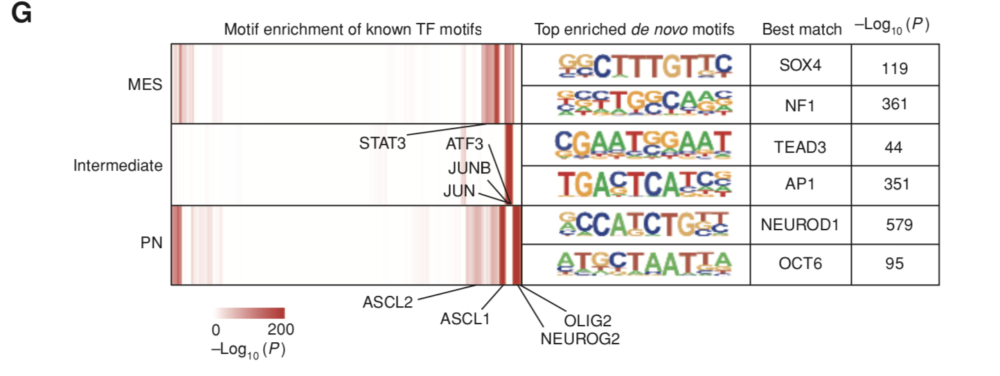
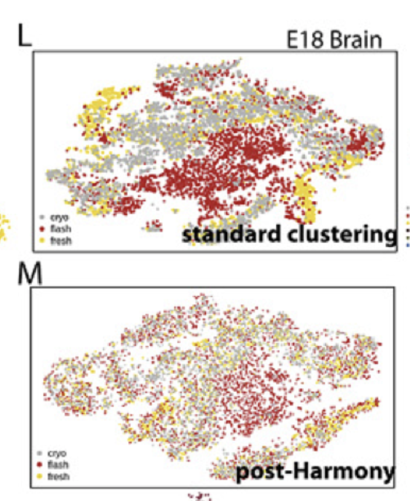

## Single-cell multiomic analysis identifies regulatory programs in mixed-phenotype acute leukemia
Steps:  
1. QC   
	* TSS Enrichment - 8  
	* Unique Nuclear Fragments - 1000  
2. Count Tn5 corrected ATAC-Seq Insertion Sites for each single cell w.in 2.5kb windows
3. Binarize  windows for each single cell and TF-IDF transform & SVD (LSI) w top 20.000 accessible windows
4. SNN(Seuret) Clustering untilminumum of 200 cells per cluster
5. Create ATAC-Seq Tn5 insertion bed files  for each cluster then call peak summits w MACS2(q<0.05)
6. Use the  top 200.000 non-overlapping extended (+- 250bp) summits and identify the mostsignificant non-overlapping extended summits across  all clusters
7. Count Tn5 corrected ATAC-Seq Insertion sites for each single cell within each identified ATAC-Seq peak  to create  a counts matrix
8. Binarize peaks and compute TF-IDF transform and perform Singular Value Decomposition (LSI) w all accesible peaks
9. SSN(Seuret) Clustering, Cluster sums and compute logCPM normalize and then determine most variable peaks across clusters
10. Binarize Peaks for each single cell and compute TF-IDF transform and perform Singular Value Decomposition (LSI)w the most variable peaks.
11. SSN Clustering

Nice Plots:
1. Average track of all clusters displayed (left top), binarized 100 random scATAC-seq tracks for each locus at a resolution of 100 bp (left bottom), scRNA-seq log2 violin and box plots of normalized expression

2. scRNA-seq heat map of upregulated genes (LFC > 0.5 and two-sided t test FDR < 0.01) log2(fold changes) comparing MPAL disease subpopulations to closest non-redundant normal cells. Differential genes were clustered using k-means clustering (k = 10) on the basis of their log2(fold changes). Right, scATAC-seq heat map (ordered by scRNA-seq hierarchal clustering on the left) of differentially upregulated accessible peaks (LFC > 0.5 and two-sided t test FDR < 0.01) log2(fold changes) comparing MPAL disease subpopulations
to the closest non-redundant normal cells. Differential peaks were clustered using k-means clustering (k = 10) on the basis of their log2(fold changes).

3. Pearson correlation of the log2(fold changes) (from 2) for differentially upregulated genes and peaks across all MPAL subpopulations.

### Thoughts
* Too many TF-IDF & SVD operations.
* TSS Enrichment > 8 is super high threshold for other datasets.
* SSN Clustering??

## The Phenotypes of Proliferating Glioblastoma Cells Reside on a Single Axis of Variation
Steps:  
1. CellRanger ATAC(version 1.1.0) was used for read  alignment, deduplication,and identifying transposase cutsites.
2. SnapATAC - QC  
	* Number of filtered fragments > 1000
	* Fragments in promoter ratio (FRiP) > 0.2
3. Clustering (SNN - FindClusters) snapATAC gene-body accesibility scores generated by snapATAC.  
4. Differentially accesiable regions - *snapATAC(findDAR)*
5. Peaks - *snapATAC(findDAR)*
6. Motif Enrirchments - *snapATAC(runHomer)*

Nice Plots:
1. Clustering of gene-body activity scores w. box plots of activity scores for genes

2. Cluster specific motifs and associated transcription factors

### Thoughts
* Did not see any normalization 

## Rapid Generation of Somatic Mouse Mosaics w Locus-Specific, Stably Integrated 
Steps:  
1. CellRanger was used to identify and 
	i. annotate open chromatin regions 
	ii. perform aggregation of samples 
	iii. Clustering of samples & motif analysis

2. Cellranger outputs were used as inputs for cisTopic and snapATAC
3. Harmony package wasused according to default settings to align snapATAC to E18.

Nice Plots:  
1.  tSNE of 3 combined scATAC-seq datasets from E18 brain after standard clustering.tSNE of samples from (up) post-Harmony alignment.

### Thoughts
* Not mentioning about functions, or normalizing steps and no code available. 

## Single-cell epigenomic identification of inherited risk loci in Alzheimer’s and Parkinson’s disease

