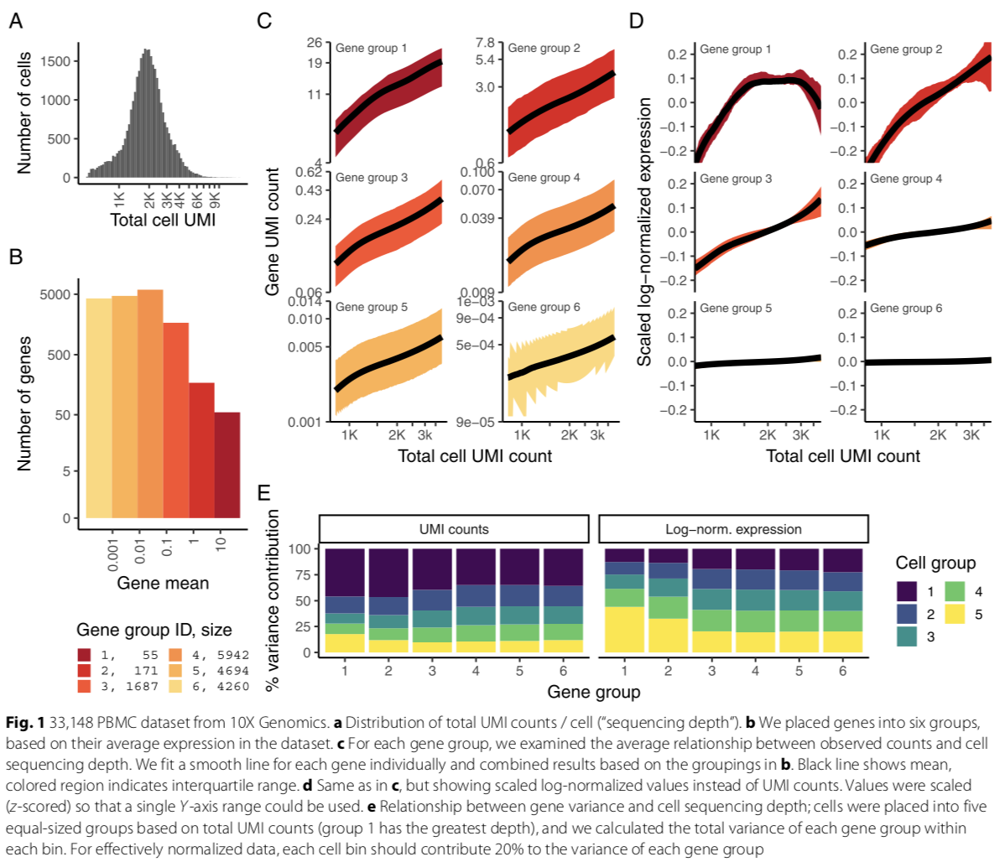

Why do we need normalization in scRNA?  
* Sequencing depth (number of genes or molecules detected per cell) can vary significantly between cells, with variation in molecular counts potentially spanning an order of magnitude, even within the same cell type
* Now widespread use of unique molec- ular identifiers (UMI) in scRNA-seq removes technical variation associated with PCR, differences in cell lysis, reverse transcription efficiency, and stochastic molecular sampling during sequencing also contribute significantly, necessitating technical correction.

An effective normalization workflow should have the following characteristics:
* Remove the influence of technical effects in the underlying molecular counts, while preserving true biological variation.
* Ingeneral,the normalizedexpressionlevelofagene should not be correlated with the total sequencing depth of a cell. Downstream analytical tasks (dimensional reduction, differential expression) should also not be influenced by variation in sequencing depth.
* Thevarianceofanormalizedgene(acrosscells) should primarily reflect biological heterogeneity, independent of gene abundance or sequencing depth.

## sctransform

